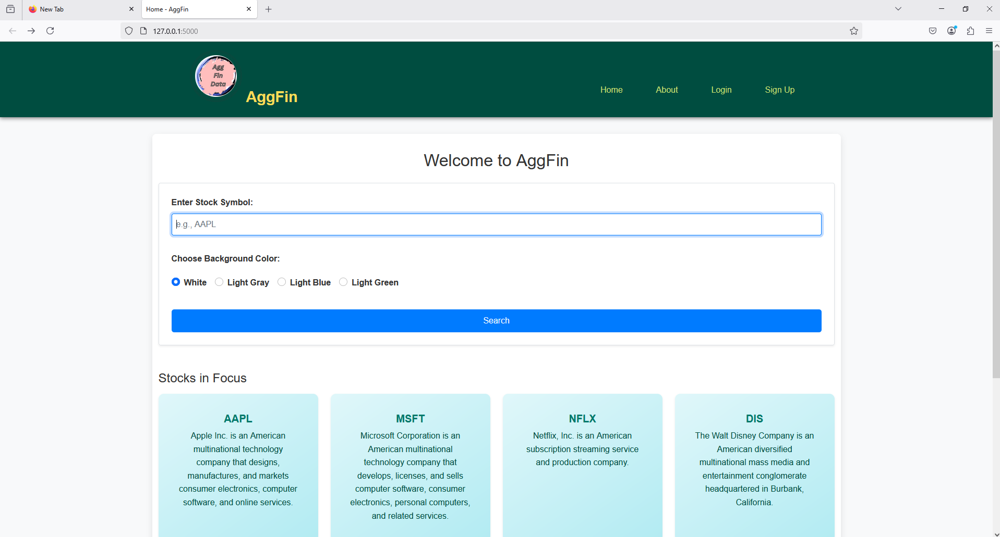
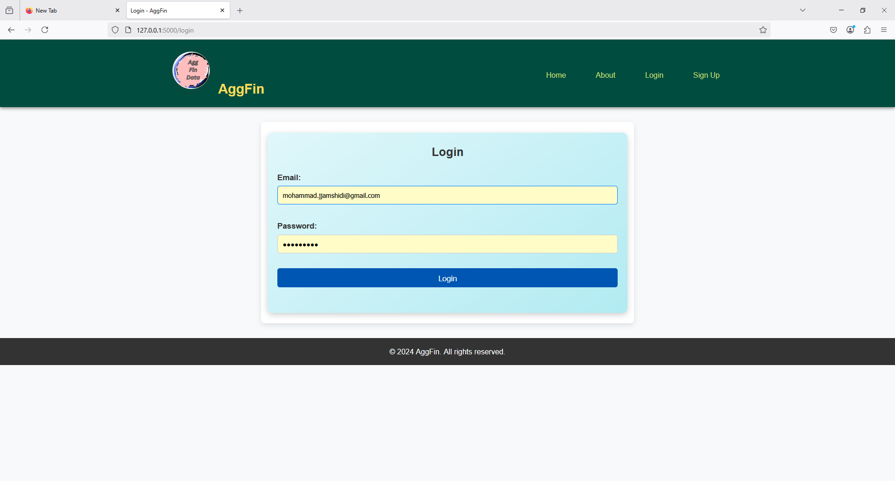
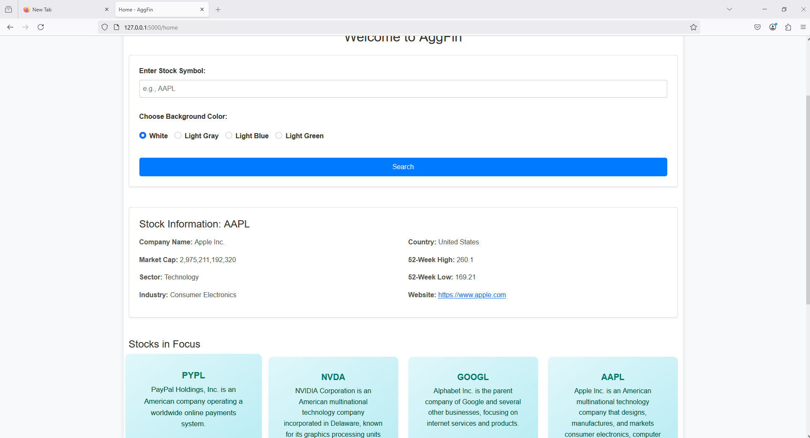
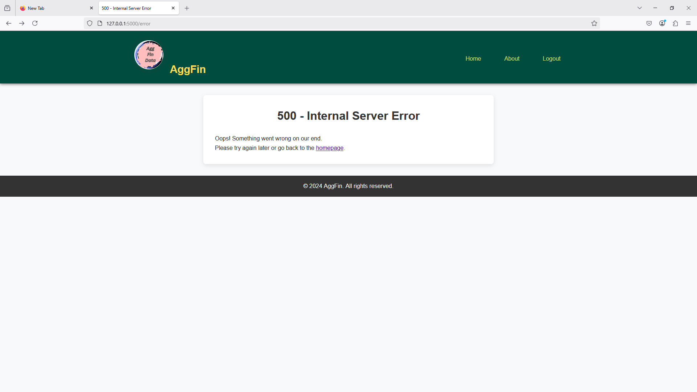
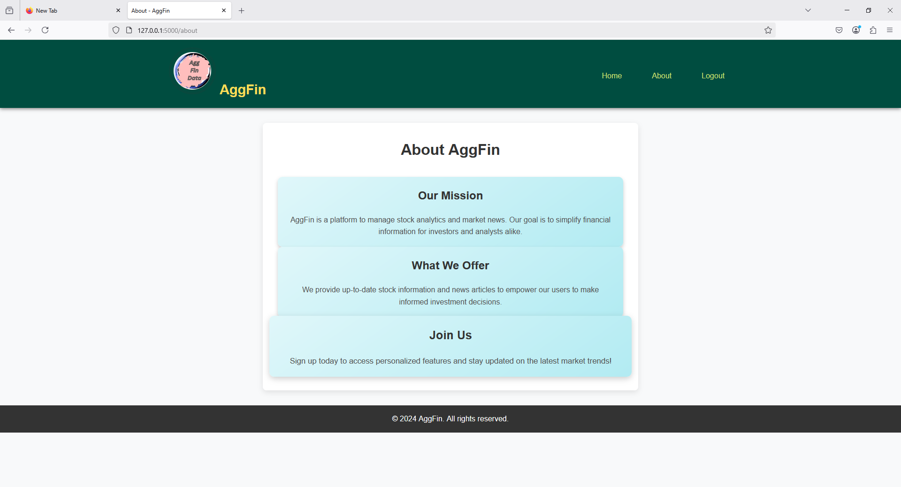

# User Guide

This section you can find the details regarding how to use AggFin application from user’s experience.

---

## 1. Accessing the App

- Open your browser and go to `http://localhost:5000`.
- You will see a homepage with a stock search bar and navigation bar.

---

## 2. User Registration

- Click on **"Sign Up"** button.
- Fill the form with email and password.
- Submit the form to create an account.

---

## 3. Logging In

- Click **"Login"** in navbar.
- Enter your registered email and password.
- If valid, you'll be redirected to homepage.

---

## 4. Searching for Stock Data

- Type a valid stock symbol (e.g., `AAPL`, `GOOGL`) in the search bar.
- Select a background color (optional).
- Click "Search."
- The app displays:
  - Company info from `yfinance`
  - Top 3 recent news articles

---

## 5. Responsive UI

- The application layout can be usable to different screen sizes and devices.

---

## 6. Error Handling

- Typing unknown route by **404 error page**.
- API issues or internal errors show **500 error page**.

---

## 7. About Page

- “About” page has platform’s mission and purpose.

---

## 8. Navigation Overview

- navigation bar includes:
  - Home
  - About
  - Suggest (autocomplete)
  - Register / Login / Logout
- After logging in, you'll stay authenticated until you log out.

---

> All screenshots recorded in a safe way to avoid exposing passwords or sensitive API keys. Contents are cropped where needed.
